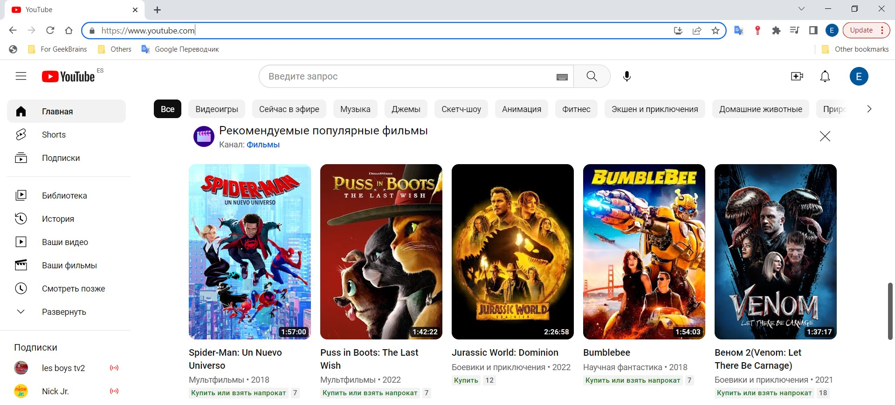

Определите, на каком протоколе работает сайт youtube.com.

Сделайте скриншот с названием 1_protocol.jpg, по которому станет понятно, как вы определили протокол сайта.

**Youtube работает на протоколе https**

