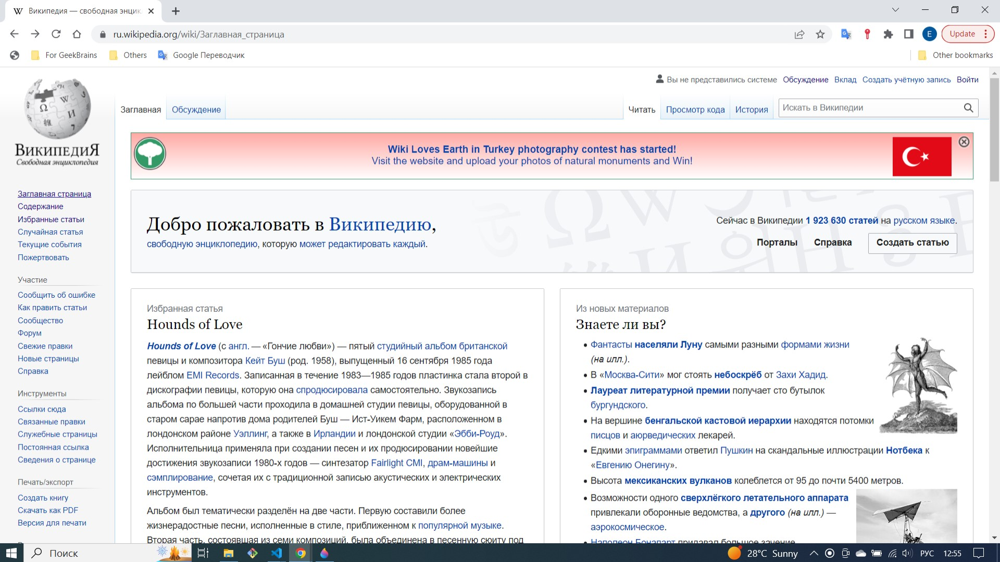
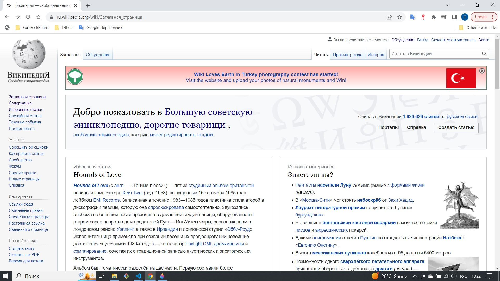
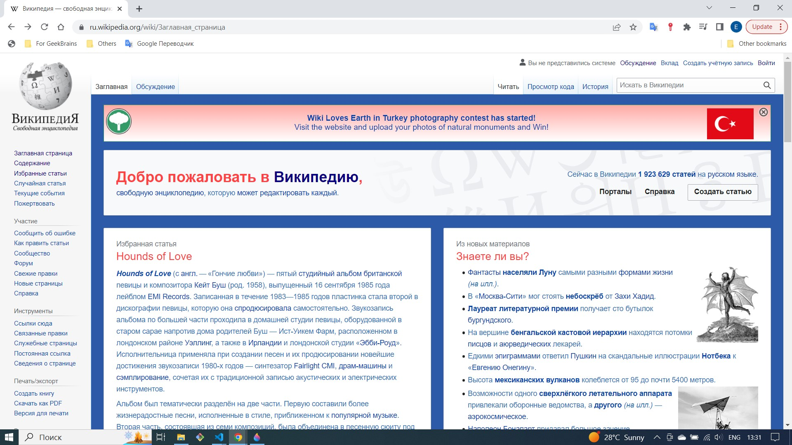
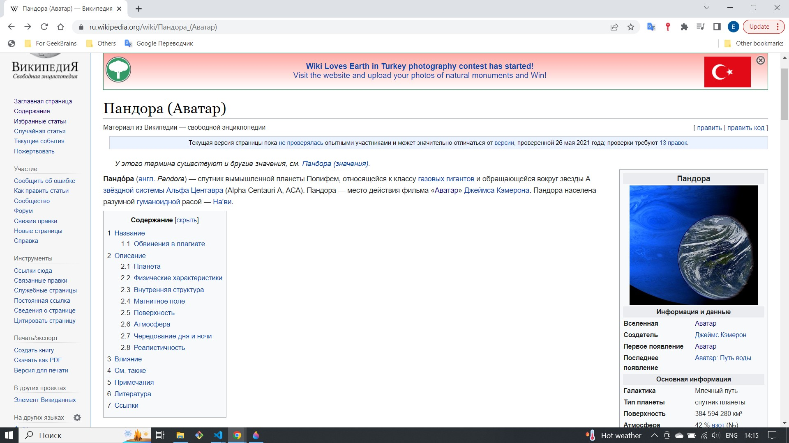
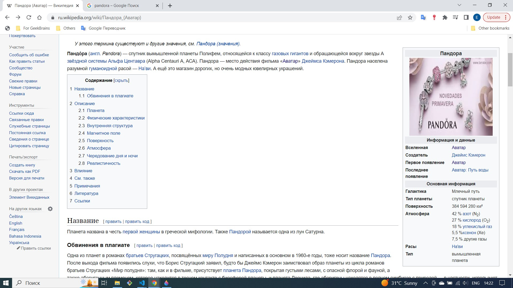
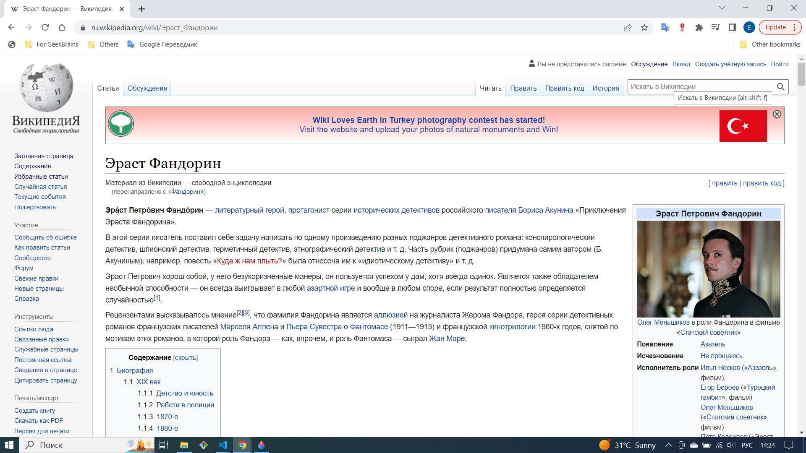
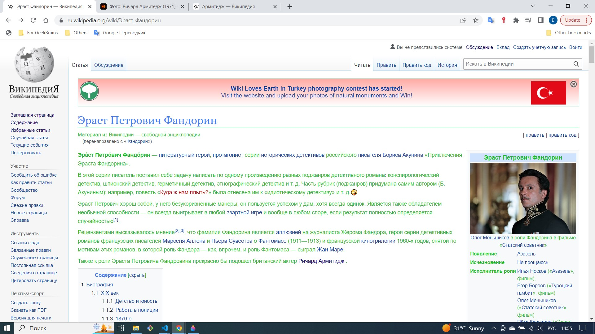

Внесите не менее 10 изменений на страницу любой статьи сайта https://ru.wikipedia.org/, с помощью инструмента разработчика и представьте два скриншота было/стало (скриншоты должны иметь названия 3_before.jpg, 3_after.jpg соответственно). Желательно поработать с изменением текста на странице, заменой картинки, изменением стилей.

**Изменение №1_было**
  

**Изменение №1_стало**
  

**Изменение №2_3_4_было**
 

**Изменение №2_3_4_стало**
 (2_размер и 3_цвет шрифта, 4_цвет заднего фона)
 

**Изменение №5_6_было**
  

**Изменение №5_6_стало** (5_фото, 6_добавлен текст)
  

**Изменение №7_8_9_10_было**
  

**Изменение №7_8_9_10_стало** (7_изменен заголовок: добавлен текст, изменен стиль шрифта и цвет; 8_изменен цвет всего текста статьи; 9_добавлен смайлик; 10_добавлен текст в статью со ссылкой на другую статью Википедии)
  
